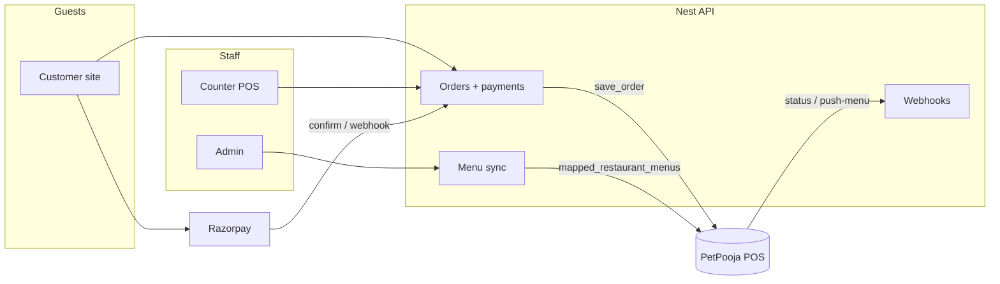

# Chote Bade Café — Order System

<p align="center">
  <strong>Customer ordering · Counter POS · Admin · Nest API</strong><br />
  Payment + kitchen handoff that feeds <strong>PetPooja</strong> — not a full POS replacement.
</p>

<p align="center">
  <a href="#quick-start">Quick start</a> ·
  <a href="#architecture">Architecture</a> ·
  <a href="#petpooja-go-live">PetPooja</a> ·
  <a href="#integrations">Integrations</a> ·
  <a href="#deploy">Deploy</a> ·
  <a href="#security">Security</a>
</p>

---

## What this is

A pnpm monorepo for **Chote Bade Café**: guests order from the brand site (QR / web), pay online or at the till, and confirmed orders push into **PetPooja** for the kitchen. Staff run counter POS and admin; the API owns orders, menu sync, payments, and realtime updates.

| Surface | Path | Dev URL | Role |
|---|---|---|---|
| Customer site | `apps/customer-app` | http://localhost:3000 | Menu, cart, pay, order status, Memory Wall |
| Counter POS | `apps/counter-pos` | http://localhost:5173 | Till orders, claim/collect, PetPooja retry |
| Admin | `apps/admin` | http://localhost:5174 | Staff, integrations, menu sync, moderation |
| API | `apps/backend` | http://localhost:3001 | NestJS + Prisma + Socket.IO |

**Shared packages:** `@cafe/shared-types` · `@cafe/database` (Prisma) · connection helpers in `packages/`

---

## Architecture



**Happy path:** pay → order `confirmed` → PetPooja `save_order` → kitchen status callbacks → ready notification chain.

---

## Quick start

```bash
cp .env.example .env
docker compose up -d          # Postgres + Redis
pnpm install                  # prisma generate via postinstall
pnpm db:migrate
pnpm db:seed                  # optional — demo staff + menu
pnpm dev                      # API + customer + counter + admin
```

| App | Command |
|---|---|
| All (Turbo) | `pnpm dev` |
| API only | `pnpm --filter @cafe/backend dev` |
| Customer | `pnpm --filter @cafe/customer-app dev` |
| Counter | `pnpm --filter @cafe/counter-pos dev` |
| Admin | `pnpm --filter @cafe/admin dev` |

### Seed staff (change before production)

| Name | PIN | Role |
|---|---|---|
| Admin | `1234` | Full admin |
| Manager | `2345` | Ops (menu sync, retry push, Memory Wall) |
| Cashier | `3456` | Counter only — blocked from admin UI |

Health: `GET http://localhost:3001/health`  
Integrations: `GET http://localhost:3001/health/integrations`

---

## PetPooja go-live

Live adapters are implemented against **PetPooja Online Ordering API V2.1.0**. Keep `PETPOOJA_ADAPTER=fake` until credentials arrive; then flip to live.

### 1. Credentials (from PetPooja support)

```env
PETPOOJA_APP_KEY=
PETPOOJA_APP_SECRET=
PETPOOJA_ACCESS_TOKEN=
PETPOOJA_REST_ID=
PETPOOJA_WEBHOOK_SECRET=          # long random — required even in fake mode
PUBLIC_API_URL=https://api.example.com   # no trailing slash
PETPOOJA_ADAPTER=live
```

Optional: `PETPOOJA_CALLBACK_URL` if the status webhook is not `{PUBLIC_API_URL}/petpooja/webhooks/order-status`.

### 2. What goes live

| Direction | Endpoint | Purpose |
|---|---|---|
| Us → PetPooja | `POST …/V1/save_order` | Push paid/confirmed orders |
| Us → PetPooja | `POST …/V1/mapped_restaurant_menus` | Pull catalog into our menu |
| PetPooja → us | `POST /petpooja/webhooks/order-status` | Accept / Reject / Food Ready |
| PetPooja → us | `POST /petpooja/webhooks/push-menu` | Catalog changed → re-sync |

### 3. Tell PetPooja support

Register these partner URLs (same host as `PUBLIC_API_URL`):

- **Order status:** `/petpooja/webhooks/order-status`
- **Push menu:** `/petpooja/webhooks/push-menu`

Auth (any one):

- `Authorization: Bearer <PETPOOJA_WEBHOOK_SECRET>`
- `x-api-key: <PETPOOJA_WEBHOOK_SECRET>`
- `x-petpooja-signature: <HMAC-SHA256 hex of raw body>`

### 4. First live checklist

1. Deploy with credentials + `PUBLIC_API_URL`
2. Set `PETPOOJA_ADAPTER=live` and restart API
3. Admin → **Menu sync** (items must get real `petpoojaItemId`s)
4. Place a test paid order → confirm PetPooja receives it
5. Trigger Accept / Food Ready from POS → cafe order advances

---

## Integrations

| Integration | Default | Live |
|---|---|---|
| **PetPooja** | `PETPOOJA_ADAPTER=fake` | Keys + `PUBLIC_API_URL` + `PETPOOJA_ADAPTER=live` |
| **Razorpay** | `PAYMENT_ADAPTER=fake` | `RAZORPAY_KEY_ID` / `KEY_SECRET` (+ webhook secret) · events: `payment.captured`, `payment.failed`, `order.paid` |
| **WhatsApp / SMS** | `NOTIFICATION_ADAPTER=fake` | BSP keys — live notifier still provider-pending |

Adapter readiness is always visible at `GET /health/integrations` (detail hidden in production).

```bash
node scripts/smoke-prep.js
node scripts/audit-flow.js
```

---

## Deploy

| Path | Target |
|---|---|
| [DEPLOY-CLOUD.md](./DEPLOY-CLOUD.md) | Render free tier (create services by hand — **no Blueprint**) |
| [DEPLOY.md](./DEPLOY.md) | Single VPS · Docker + Caddy |

**VPS short path:**

```bash
cp .env.production.example .env.production
# fill secrets, SITE_ADDRESS, CORS_ORIGINS, PUBLIC_API_URL
pnpm deploy:check
pnpm deploy:up
```

| Public path | App |
|---|---|
| `/` | Customer |
| `/counter/` | Counter POS |
| `/admin/` | Admin |
| `/api/*` | Nest API |

---

## Security

| Rule | Detail |
|---|---|
| Secrets stay local | Only `.env.example` and `.env.production.example` are in git |
| Scan before ship | `pnpm check:secrets` (also runs on GitHub push/PR) |
| No understanding dumps | Internal notes / audit reports are gitignored |
| Production gates | Weak `STAFF_SESSION_SECRET`, `ALLOW_FAKE_PAYMENTS=1`, and localhost-only CORS refuse to boot in production |

Never commit `.env`, keys, PEMs, or live Razorpay / PetPooja credentials.

---

## Repo layout

```
apps/
  customer-app/     Brand site + ordering
  counter-pos/      Till + kitchen handoff UI
  admin/            Staff + integrations
  backend/          Nest API (orders, PetPooja, payments, memory)
packages/
  shared-types/     DTOs + socket events + cafe menu seed
  database/         Prisma client package
prisma/             Schema + migrations + seed
scripts/            Smoke, audit, secret scan, brand assets
```

---

## License / contact

Private cafe project. PetPooja credentials: [support@petpooja.com](mailto:support@petpooja.com).
